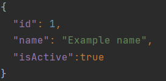
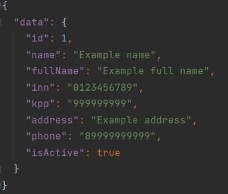
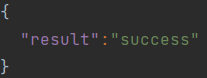
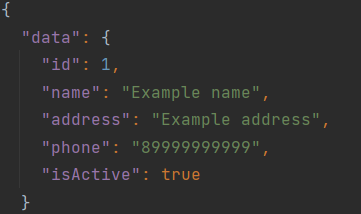
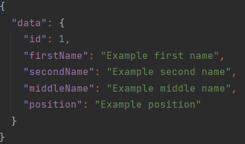
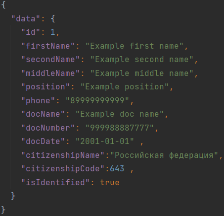

Organization API 
======================

### API для доступа и управления данными:

* Организаций 
* Офисов организаций 
* Работников

> Swagger-документацию можно получить по ссылке: http://localhost:8888//swagger-ui.html
----
# Как работать с API
> * Для доступа к данным нужно ввести: http://localhost:8888/ *требуемое_действие*
> * В случае успешной операции, в ответ вернутся данные в формате JSON
> * В случае ошибки будет возвращено описание ошибки, код статуса
>   * В случае ошибки сервера вернётся код ошибки

# Организация

Организация имеет следующие поля:

Поле     | Описание 
---------|------------
id       | Уникальный идентификатор
name    |  Название организации   
fullName|   Полное название организации
inn     |   ИНН
kpp     |   КПП
address |   Адрес организации
phone   |  Телефонный номер организации
isActive|  Флаг активности организации

### Получить список организаций по фильтру
Чтобы получить список организаций, нужно по адресу *api/organization/list* отправить POST запрос,
при этом добавив в тело запроса следующие параметры фильтрации в формате JSON:

Поле     | Обязательное
---------|-------------|
name     |+              
inn      |
isActive |

Если подходящие организации найдутся, ответ будет содержать:

---
### Получить организацию по уникальному идентификатору
Чтобы получить организацию по ID, нужно отправить GET запрос по адресу: api/organization/ *требуемый_id*

Ответ будет содержать:

---
### Добавление новой организации 
Чтобы добавить новую организацию, нужно по адресу *api/organization/save* отправить POST запрос,
при этом добавив в тело запроса следующие параметры в формате JSON:

Поле     | Обязательное
---------|-------------|
name    |+
fullName|+
inn     |+
kpp     |+
address |+
phone   |
isActive|

Ответ в случае успешного завершения операции будет содержать:

---
### Обновление данных организации
Чтобы обновить данные организации, нужно по адресу *api/organization/update* отправить POST запрос,
при этом добавив в тело запроса следующие параметры фильтрации в формате JSON:

Поле     | Обязательное
---------|-------------|
id      |+
name    |+
fullName|+
inn     |+
kpp     |+
address |+
phone   |
isActive|

Ответ будет содержать:

---
# Офис

Офис имеет следующие поля:

Поле     | Описание
---------|------------
id       | Уникальный идентификатор
orgId    | Идентификатор организации, к которой прикреплён офис
name    |  Название офиса
address |   Адрес офиса
phone   |  Телефонный номер офиса
isActive|  Флаг активности офиса

### Получить список офисов по фильтру
Чтобы получить список офисов, нужно по адресу *api/office/list* отправить POST запрос,
при этом добавив в тело запроса следующие параметры фильтрации в формате JSON:

Поле     | Обязательное
---------|-------------|
orgId    | +
name     |
phone    |
isActive |

Если подходящие офисы найдутся, ответ будет содержать:

---
### Получить офис по уникальному идентификатору
Чтобы получить офис по ID, нужно GET запрос по адресу: api/office/ *требуемый_id*

Ответ будет содержать:

---
### Добавление нового офиса
Чтобы добавить новый офис, нужно по адресу *api/office/save* отправить POST запрос,
при этом добавив в тело запроса следующие параметры в формате JSON:

Поле     | Обязательное
---------|-------------|
orgId    |+
name     |
address  |
phone    |
isActive |

Ответ в случае успешного завершения операции будет содержать:

---
### Обновление данных офиса
Чтобы обновить данные офиса, нужно по адресу *api/office/update* отправить POST запрос,
при этом добавив в тело запроса следующие параметры фильтрации в формате JSON:

Поле     | Обязательное
---------|-------------|
id      |+
name    |+
address |+
phone   |
isActive|

Ответ в случае успешного завершения операции будет содержать:

---
# Пользователь

Пользователь имеет следующие поля:

Поле      | Описание
----------|------------
id        | Уникальный идентификатор
officeId  |ID офиса, к которому принадлежит пользователь
firstName | Имя пользователя
secondName| Второе имя пользователя
lastName  | Фамилия пользователя
middleName| Отчество пользователя
position  | Должность пользователя
phone     | Телефонный номер пользователя
citizenshipCode| Код гражданства пользователя
isIdentified| Флаг идентификации пользователя

Документ пользователя имеет следующие поля:

Поле      | Описание
----------|------------
docCode   | Код типа документа
docName   | Наименование документа
docNumber | Номер документа
docDate   | Дата получения документа

### Получить список пользователей по фильтру
Чтобы получить список пользователей, нужно по адресу *api/user/list* отправить POST запрос,
при этом добавив в тело запроса следующие параметры фильтрации в формате JSON:

Поле     | Обязательное
---------|-------------|
officeId |+
firstName|
lastName |
middleName|
position  |
docCode   |
citizenshipCode|

Если подходящие пользователи найдутся, ответ будет содержать:

---
### Получить пользователя по уникальному идентификатору
Чтобы получить пользователя по ID, нужно вставить его в адрес запроса: api/user/ *требуемый_id*

Ответ будет содержать:

---
### Добавление нового пользователя
Чтобы добавить нового пользователя, нужно по адресу *api/user/save* отправить POST запрос,
при этом добавив в тело запроса следующие параметры в формате JSON:

Поле     | Обязательное
---------|-------------|
officeId  |+
firstName |+
secondName|
middleName|
position  |+
phone     |
docCode   |
docName   |
docNumber  |
docDate     |
citizenshipCode|
isIdentified|

В случае успешного завершения операции ответ будет содержать:

---
### Обновление данных пользователя
Чтобы обновить данные пользователя, нужно по адресу *api/user/update* отправить POST запрос,
при этом добавив в тело запроса следующие параметры фильтрации в формате JSON:

Поле     | Обязательное
---------|-------------|
id        |+
officeId  |
firstName |+
secondName|
middleName|
position  |+
phone     |
docName   |
docNumber  |
docDate     |
citizenshipCode|
isIdentified|

В случае успешного завершения операции ответ будет содержать:

---
> # Справочники 
>
> ### Типы документов
> Чтобы получить все типы документов, нужно отправить GET запрос по адресу *api/docs*
> ### Страны
> Чтобы получить список стран, нужно отправить GET запрос по адресу *api/countries*
